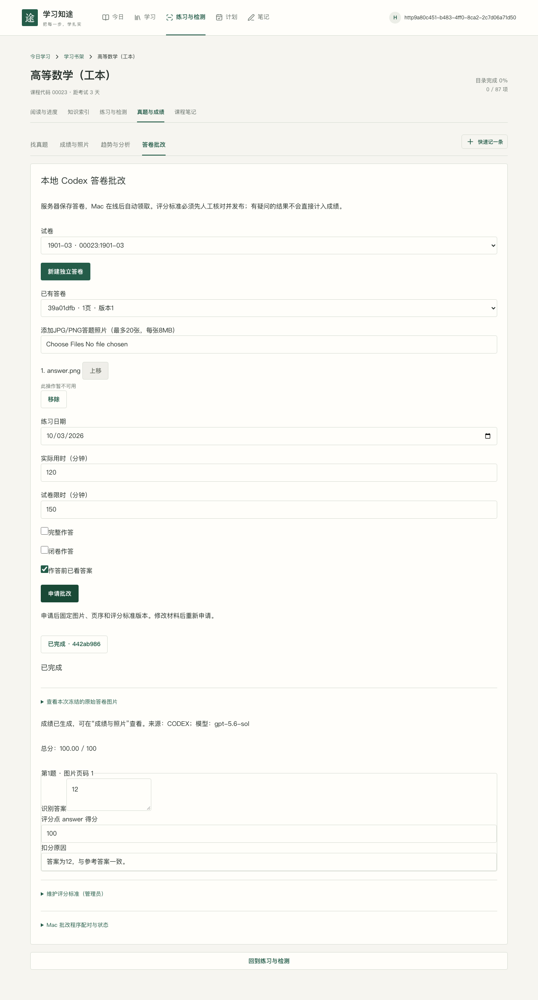
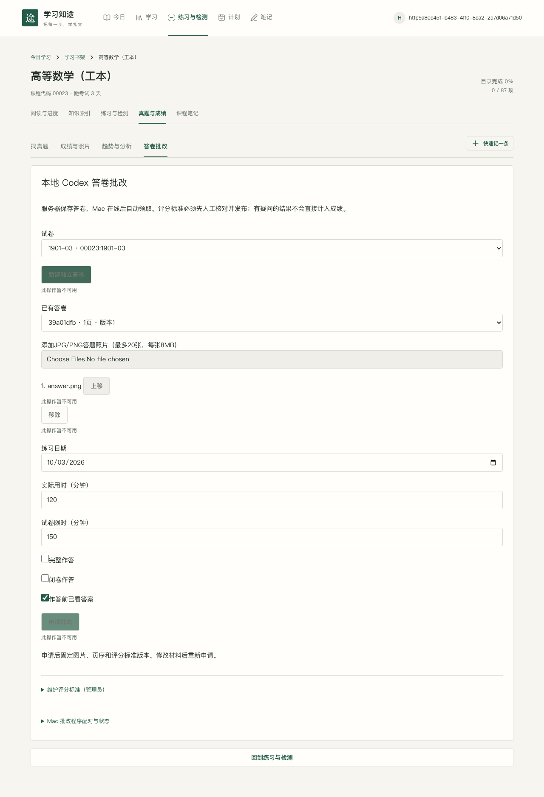
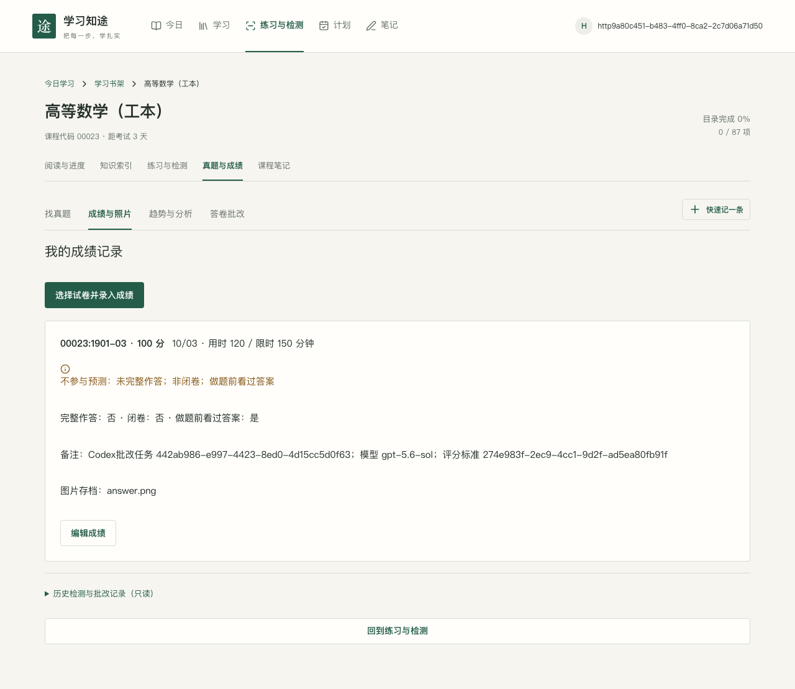

# 服务器申请、Mac 本地 Codex 批改

## 运行边界

Java后端、MySQL、网页和私有答卷在服务器；Mac主动通过HTTPS拉取任务。服务器无需Codex，也不连接Mac。工作程序在 `mac-grader/`，Node22+TypeScript，使用官方 `codex app-server --listen stdio://`。不使用OpenAI API Key，不模拟桌面点击、不给聊天发送消息。CLI协议所需code-mode host保留，工作程序不执行工具请求。提供者配置使用独立名称，避免0.147.0禁止覆盖内置openai的限制；仍使用本地ChatGPT授权，并关闭模型HTTP/流自动重试。

已核对[官方app-server协议](https://learn.chatgpt.com/docs/app-server)和[配置文档](https://learn.chatgpt.com/docs/config-file/config-reference)。本地CLI为0.147.0，实际ChatGPT Plus授权、localImage及outputSchema探针成功。线程独立且ephemeral；独立CODEX_HOME只链接本地auth.json，禁用shell、额外图片读取工具、MCP/插件、浏览器、技能、记忆和其他项目配置。输入图片通过localImage传入，PDF先在Mac用pdftoppm渲染成图片；模型进程不继承服务器凭证。

## 网页操作

课程 → 真题与成绩 → 答卷批改。先选择周期/试卷，成绩写入权限须按现有规则解锁。管理员可从试卷和答案PDF申请评分标准草稿，也可人工建立版本。逐题核对题干、参考答案、满分及评分点，保存草稿后点击发布。每题评分点合计须等于该题满分，全卷100分。发布版本不可修改，变更创建新版本。

新建答卷不要求填写成绩。上传真实JPG/PNG，最多20张、每张8MiB，调整页序；填写练习日期、实际用时、限时、完整作答/闭卷/提前看答案后申请。无已发布标准不能申请。默认信息保守（未声明完整/闭卷、已看答案），不从照片推断。

申请固定图片、SHA256、页序、评分标准版本和练习信息。修改答卷不会改变旧任务；修改后的版本重新申请。同版本、相同信息重复点击返回原任务，不同信息返回冲突。需重复练习时新建答卷。状态每5秒查询，待核对、完成或失败后停止任务轮询。90秒没有工作程序心跳显示离线等待，而非直接失败。

逐题展示识别答案、评分点得分、扣分原因、图片页码和待核对项；总分独立后端计算。待核对时可以查看冻结原图并修改答案、分值、原因及页码，处理全部疑问后确认。生成成绩、逐题结果、照片关联及完成状态在同一事务中。照片缺失时回滚全部成绩写入。CODEX来源、任务、模型、评分标准版本保留；原模型结果另存model_result_document，人工修订不会覆盖原模型输出。成绩仍按现有资格条件参与预测，不赋予检测通过资格。

## 数据与接口

新增V10，保留V1–V9。6张新增表：grading_submission、grading_submission_page、grading_rubric、grading_worker、grading_task、grading_task_page；score_record来源约束增加CODEX。既有成绩字段、附件和历史保持不变，无旧数据重写。新答卷图片复用私有SCORE_IMAGE存储、完整图像解码检测、事务补偿和清理日志。第一版答卷仅支持JPG/PNG；既有成绩附件的WebP保持可读，不改写或删除。被任务引用的图片在答卷移除后保留，以保障输入及成绩追溯；没有任务引用的移除图片走原有可恢复删除流程。

[OpenAPI](openapi.yaml)是完整请求/响应及约束；同步到相邻frontend/docs/openapi.yaml和父docs/openapi.yaml。前端类型由Orval生成，业务层引用生成类型。原成绩照片上传接口仍是照片存档，不隐式申请；历史归档只读，不替换成新任务。

| 范围 | 接口 |
| --- | --- |
| 答卷 | /api/v1/grading/submissions，/{id}，/{id}/pages，/{id}/pages/{file} |
| 用户任务 | /submissions/{id}/tasks，/tasks/{id}，/tasks/{id}/inputs，/tasks/{id}/materials/{file}，/tasks/{id}/review |
| 评分标准 | /rubrics，/rubrics/{id}，/rubrics/{id}/publish，/rubric-tasks |
| 配对 | /workers，/workers/{id} |
| 工作程序（单独权限链） | /api/v1/grading-worker/heartbeat，/claim，/tasks/{id}/renew，/tasks/{id}/materials/{file}，/tasks/{id}/result，/tasks/{id}/failure |

工作程序必须用X-Worker-Token，不能使用用户JWT。材料另需X-Claim-Token；续租/回传/失败正文包含leaseToken。凭证256位随机，服务器仅存SHA256，只有本人任务处理权限。网页只有管理员能够创建/编辑/发布公共评分标准。配对凭证不能访问用户接口、管理员接口或任意文件。撤销后每次操作重新验证；换新凭证完成配对后撤销旧凭证。

## 可靠性

用户行锁串行申请/成绩写入；任务行锁、FOR UPDATE SKIP LOCKED原子领取。同一用户同时最多一项活动任务，即使配对多台Mac。租约120秒，Mac每30秒心跳和续租，领取截止15分钟；续租不能延长截止。旧凭据不能读取、续租、更新新领取结果。租约过期由下一次领取恢复排队，最多3次处理，离线本身不触发失败。

模型完成后结果先原子写入并同步磁盘，再回传。连接失败最多重试两次，之后保留pending.json等待恢复；恢复先回传，禁止重新调用模型。重复相同回传幂等；不同结果冲突。服务器拒绝或租约变更时保留stale/rejected结果。租约过期后，程序可重新合法领取同一冻结任务；仅在输入完全一致、保存结果于原截止前完成且未被校验拒绝时，复用结果并用新领取凭据回传，不再次调用模型。材料变化、结果被拒绝或完成时间无法证明时保留材料供人工处理；旧凭据始终不能覆盖新结果。登录/用量问题暂停领取并上报原因，恢复需本地登录或额度恢复后显式resume。Codex拒绝、结构不合法、PDF不可读等确定性问题报告失败。

进程中断时服务器保留任务，租约到期可重新领取；已持久化完成结果优先回传。Mac睡眠跨越截止时恢复会终止当前会话。临时材料收到服务器确认才清理；失败、旧租约结果不自动删除。工作程序单实例锁和launchd防止同时运行；状态目录仅本人可读。不得在活跃任务期间人工删除状态目录。

## 服务器更新与回退

1. 停止新批改申请及Mac领取，在独立副本验证V10。备份MySQL、私有文件和应用版本，依照[既有备份/校验步骤](refactor/03-migration-and-operations.md)生成数据库与附件清单。
2. 构建backend与frontend。部署前按production配置显式设置DB_URL、DB_USER、DB_PASSWORD、JWT_SECRET_BASE64、APP_FILES_ROOT；服务器只需可出站/入站HTTPS，不需要Codex账户信息。
3. 启动新后端，Flyway应用V10；校验旧表数量、关键字段和关联，运行health/readiness。发布前端并代理/api，限制multipart上传；原始私有目录不能公开托管。代理和应用日志不得记录X-Worker-Token/X-Claim-Token、请求正文、成绩图像或配对响应。
4. HTTPS域名证书正常后在网页配对Mac，启动本地程序；发布管理员核对过的评分标准，用独立验证账号演练，再决定正式启用。本次没有部署服务器。
5. 回退前暂停程序和网站写入；CODEX来源对旧版本不兼容，不能只切旧jar。保全新增答卷/任务/标准/成绩及私有文件，恢复同一时间点的数据库与文件备份和对应应用；不要DROP表或删除照片尝试降级。待新版本修复后再受控合并新增数据。

## 验证范围

真实本地Codex图片与结构化输出已成功；真实浏览器→独立MySQL/Spring Boot→Mac app-server→回传→CODEX成绩链路已成功。采用人工确认答案和预期100分的受控印刷算式答卷；这是业务机制验证，不能代表复杂手写自考试卷的准确率。当前没有提供真实人工批改答卷，因此手写识别、复杂评分点和人工分数的一致性仍需补充验收样本。

模拟故障测试和真实调用分别记录于 `docs/grading-evidence/`（汇总、截图），原始测试运行输出在target，不提交测试凭证。本机没有人为耗尽账户额度、撤销ChatGPT授权、实际睡眠15分钟或切断公网；这些行为以可控故障和时间/租约失效测试验证，不能宣称实际系统睡眠或额度限制已现场通过。

### 本次结果

- 后端30个单元测试、65个独立MySQL集成检查通过；新批改模块8个检查包含真实浏览器与实际Codex调用。全量运行曾因本地提供者配置失败1项；修正后重新运行受影响批改套件8项全通过，旧业务套件均通过。
- 前端236个测试通过、构建通过、API重复生成稳定；Mac工作程序12个测试通过（故障由模拟HTTP/stdio进程注入），独立目录npm ci及构建通过。
- 745个真实服务器响应覆盖129个接口，通过OpenAPI校验，包含全部26个新接口；注册/刷新等没有本次实际响应样本的操作不计入覆盖。
- 真实浏览器在批改完成后切换成绩页面，无需刷新即可读取新成绩；任务列表终态同步更新。答卷/任务列表采用批量查询，避免轮询造成逐条重复查询。
- 真实PDF→本地渲染图片→Codex→评分标准草稿成功，结果仍为DRAFT，没有自动发布或产生额外成绩。
- [验证汇总](grading-evidence/tests.json)、[真实Codex](grading-evidence/real-codex.json)、[真实PDF草稿](grading-evidence/real-pdf-draft.json)、[契约校验](grading-evidence/contract.json)。

